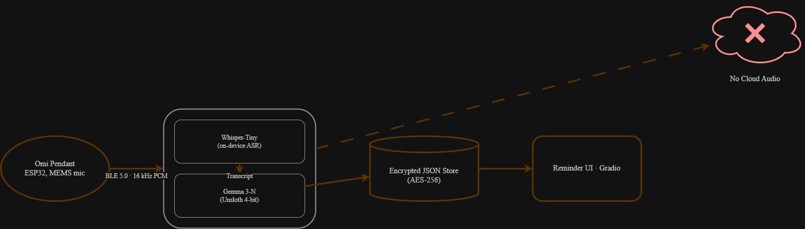

# Raynos – On-Device Gemma 3-N / Unsloth Pipeline

A privacy-first AI pipeline that processes audio locally using Gemma 3-N with Unsloth optimization. This implementation showcases real-time audio transcription with Whisper and structured data extraction, all running completely on-device with no cloud dependencies.

<p align="center">
  
  
  
  
  
</p>



🌐 **[Live Demo](https://00b0bc384e84550fd0.gradio.live/)** | 📹 **[Video Walkthrough](https://youtu.be/u2AMK56FoY4)** | 📦 **[GitHub Repository](https://github.com/mmusil25/raynos-ai)**


## 🚨 Important Disclosure

**This is a proof-of-concept implementation** that demonstrates the core AI pipeline for audio processing and structured data extraction using Gemma 3-N. The current implementation supports microphone input and file uploads through a Gradio web interface.

## 🎯 Features

- **Real-time Audio Processing**: Supports microphone streaming and audio file uploads through a web interface.
- **Local Transcription & NLP**: Employs Whisper for on-device transcription and Gemma 3N for intent extraction, ensuring privacy.
- **Optimized Performance**: Integrated with Unsloth for 2x faster Gemma 3N inference and reduced memory usage.
- **Interactive Web Interface**: Features a Gradio-based UI for live streaming and interaction.
- **Structured Data Output**: Delivers organized JSON output, adhering to a predefined schema.

## 🚀 Unsloth Integration (Competition Requirement)

This project uses **Unsloth** for optimized Gemma 3n inference, which is a requirement for the $10k side prize. Unsloth provides:

- **2x Faster Inference** compared to standard transformers
- **60% Less Memory Usage** enabling larger batch sizes
- **Drop-in Replacement** requiring minimal code changes
- **Automatic Optimization** for Gemma 3n-E4B-it model

### Installation

```bash
# Install Unsloth with torch support
pip install "unsloth[torch]"
```

The integration is automatic. When Unsloth is installed, the system defaults to the optimized `unsloth/gemma-3n-e4b-it` model for faster inference.

### Testing Unsloth

```bash
# Test Unsloth integration
python test_unsloth_gemma.py
```

## 📋 Requirements

- Python 3.10+
- CUDA-capable GPU (optional but recommended for fast inference)
- Ubuntu/Linux (recommended) or Windows with WSL2

- For microphone: Audio input device (not available in WSL)
- Unsloth for 2x faster Gemma 3n inference (automatically installed)

## 🚀 Quick Start

### 1. Clone and Setup Environment

```bash
git clone https://github.com/mmusil25/raynos-ai.git
cd raynos-ai

# Create virtual environment
python3.10 -m venv venv
source venv/bin/activate  # On Windows: venv\Scripts\activate

# Install dependencies
pip install -r requirements.txt
```

### 2. Install Additional Dependencies

```bash
# Core dependencies
pip install torch transformers openai-whisper gradio

# Audio processing
pip install numpy scipy sounddevice

# Optional: for better audio support
sudo apt-get install ffmpeg  # Required for Whisper
```

### 3. Run the Demo

#### Web Interface (Gradio)
```bash
python src/gradio_app_integrated.py --share
```
This will start a web server and provide a public URL if `--share` is used.


## 🏗️ Architecture

```
┌─────────────────┐     ┌──────────────────┐     ┌─────────────────┐
│  Audio Source   │────▶│  Transcription   │────▶│ JSON Extraction │
│  (Mic/File)     │     │  (Whisper)       │     │ (Gemma 3-N)     │
└─────────────────┘     └──────────────────┘     └─────────────────┘
         │                       │                         │
         └───────────────────────┴─────────────────────────┘
                                 │
                         ┌───────▼────────┐
                         │  JSON Output   │
                         │ {transcript,   │
                         │  timestamp_ms, │
                         │  intent,       │
                         │  entities}     │
                         └────────────────┘
```

## 📁 Project Structure

```
raynos-ai/
├── src/                          # Source code directory
│   ├── gradio_app_integrated.py # Main Gradio web interface
│   └── gemma_3n_json_extractor.py # Gemma 3-N JSON extraction
├── example_audio/                # Test audio files
│   └── mom.aac                  # Sample audio file
├── docs/                         # Documentation
│   └── architecture.drawio.png  # System architecture diagram
├── third_party/                  # Third-party notices
│   └── UNSLOTH_NOTICE           # Unsloth attribution
├── requirements.txt             # Python dependencies
├── LICENSE                      # Apache 2.0 license
└── README.md                   # This file
```

## 🔧 Configuration

### Environment Variables

```bash


# For GPU acceleration (automatic if available)
export CUDA_VISIBLE_DEVICES=0
```

### Audio Settings

- **Sample Rate**: 16kHz (configurable)
- **Channels**: Mono
- **Bit Depth**: 16-bit
- **Buffer Duration**: 3 seconds for streaming

## 📖 Usage Examples

### 1. Using the Gradio Interface
```python
from src.gradio_app_integrated import create_interface

# Launch the interface
if __name__ == "__main__":
    interface = create_interface()
    interface.launch(share=True)
```

### 2. Custom JSON Extraction
```python
from src.gemma_3n_json_extractor import ExtractionManager

# Initialize extractor with Gemma 3-N
extractor = ExtractionManager(extractor_type="gemma")

# Extract from transcript
result = extractor.extract_from_transcript(
    "Hello, my name is John and I need help with my order",
    timestamp_ms=1234567890
) 
print(result)
# Output: {"transcript": "...", "intent": "request", "entities": ["John"], ...}
```

## 🐛 Known Limitations

1. **WSL Audio Issues**: Microphone/audio passthrough requires complex setup in WSL environments
2. **GPU Memory**: Gemma 3-N model requires significant VRAM (recommended 8GB+)
3. **Streaming Latency**: 3-second buffer for optimal transcription accuracy
4. **Audio Format**: Currently optimized for 16kHz mono audio

## 🔍 Troubleshooting

### "PortAudio not found" 
- Install system dependencies: `sudo apt-get install portaudio19-dev`
- Or use file input instead of microphone

### "CUDA out of memory"
- Use CPU mode: `--device cpu`
- Or use smaller models/batch sizes

### Whisper fails with ffmpeg error
- Install ffmpeg: `sudo apt-get install ffmpeg`

## 🤝 Contributing

This is a proof-of-concept implementation. Key areas for improvement:

1. Hardware integration for wearable devices
2. Optimized streaming protocols
3. Better Gemma prompt engineering
4. Additional language support
5. Mobile app integration

## 📄 License

Apache 2.0 License - See LICENSE file for details

## 🙏 Acknowledgments

- OpenAI for Whisper
- Google for Gemma models
- Gradio team for the UI framework
- Community contributors to the open-source AI ecosystem

---

**Note**: This implementation demonstrates the architecture and data flow for a BLE audio processing pipeline. For production use, additional error handling, security measures, and optimization would be required.