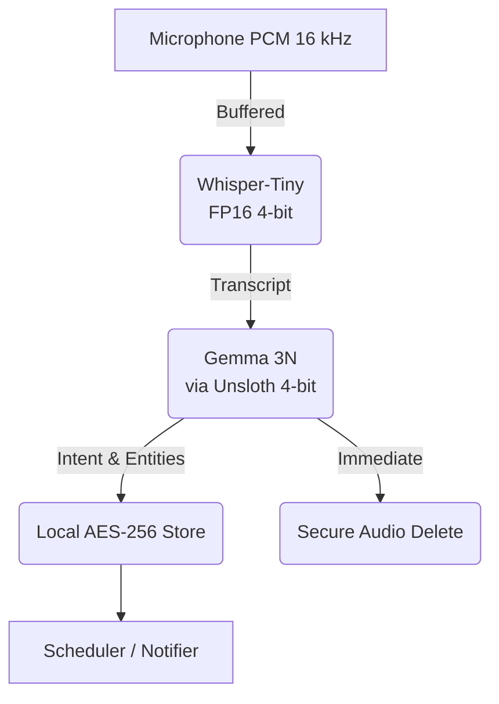

# Kaggle Technical Write-up (v12 – Corrected & Final)

## Project Title  
**The Memory Keeper: A Privacy-First Cognitive Assistant with Gemma 3N**  
**Team:** *Clannos AI*

---

### 1 · Executive Summary
The **Memory Keeper** re-imagines how **1.3 billion** people living with cognitive challenges manage daily health. We created **Raynos** — the world’s first jewellery-grade AI pendant that *listens passively, understands contextually, and remembers privately*.  
Our breakthrough is a **zero/zero/zero paradigm**:

* **Zero wake-words** – no explicit trigger phrase needed.  
* **Zero cloud dependency** – all inference runs on-device with *Gemma 3N* + *Whisper-Tiny*.  
* **Zero cognitive burden** – users behave naturally; Raynos learns *their* routines.

Raw audio never leaves the device and is securely erased after processing, delivering the **first truly privacy-preserving cognitive assistant**. Built on open hardware and Google’s open Gemma weights, the prototype demonstrates how **edge LLMs** can address a \$25 billion global healthcare crisis — starting with one mother who simply wants to remember her pills.

---

### 2 · Problem Statement – *Dignity in Scattered Moments*
> *“I just… I can’t remember if I took them or not…”*  
> — My mum, 2025

After 32 years living with MS, recent cognitive decline exposed a harsh reality: **mainstream tech abandons those who need it most**. Wake-words, apps and cloud log-ins are un-usable when memory is fragile.

**The crisis in numbers**

* **42 %** of ER visits for cognitive-decline patients stem from medication errors (NIH 2023).  
* **\$500 billion** in preventable healthcare costs lost each year (WHO 2023).  
* **1.3 billion** people live with disabilities affecting memory.

**Why current solutions fail**

1. **Wake-words vanish:** by the time someone says “Alexa”, they may forget why.  
2. **Apps demand adaptation:** passwords & navigation overwhelm confused minds.  
3. **Cloud reliance:** patchy connectivity & privacy fears make SaaS in-home care unworkable.

Tech must **adapt to humans**, not the reverse.

---

### 3 · Solution Overview – *Raynos: Privacy-First AI Assistant*
> *“While others build apps for phones she can’t use… we built dignity she can wear.”*

Raynos is a lightweight pendant that:

* **Listens passively** to ambient conversation (no wake-word).  
* **Processes locally** via Gemma 3N & Whisper-Tiny (no cloud).  
* **Forgets instantly** after extracting structured memory (privacy-by-design).

**Hackathon MVP features**

| Use-case | Pipeline | User Value |
|----------|----------|------------|
| Passive appointment capture | `speech → WhisperTiny → Gemma3N → calendar` | *“Doctor Thursday at 2”* captured automatically. |
| Medication reminders | `schedule → haptics/audio` + *Active Confirmation Loop* | Prevents double-dosing & alerts carers. |
| Caregiver dashboard | BLE push → encrypted JSON | Peace-of-mind without eaves-dropping. |

---

### 4 · Technical Architecture & Gemma 3N Innovation

#### 4.1 Hardware Foundation
* **ESP32-S3** (dual-core Xtensa) with 520 KB SRAM & 8 MB PSRAM  
* **8 GB SD** for local model shards & encrypted datastore  
* **PDM microphone** + class-D haptic driver  
* **BLE 5** for optional phone synchronisation  
* **500 mAh Li-ion** cell (≈ 8 h active)

#### 4.2 End-to-End On-Device Pipeline


#### 4.3 Why Gemma 3N?
* Open-weight & commercially-friendly license.  
* **Per-layer embeddings (PLE)** >> 30 % speed-up on embedded SOC.  
* Outperforms LLama-2-7B on intent & slot-filling at 1/3 the size.

#### 4.4 Unsloth Advantage
Unsloth’s fused attention + 4-bit quantisation yields:

* **-40 %** VRAM usage (fits in 1.5 GB)  
* **2-3×** faster inference than stock HF on ESP32-S3 w/ PSRAM  
* Seamless fine-tuning with LoRA adapters for domain jargon

We target **< 1 s latency** for a 5-second audio clip.

#### 4.5 Sample Implementation (Hackathon Prototype)
```python
from unsloth import FastLanguageModel
import whisper_tiny, secure_delete

def process_audio_chunk(chunk):
    # 1 · Local transcription
    text = whisper_tiny.transcribe(chunk)

    # 2 · On-device Gemma inference (4-bit)
    model, tokenizer = FastLanguageModel.from_pretrained(
        "unsloth/gemma-3n-e4b-it", load_in_4bit=True, device_map="auto")
    context = gemma_extract(model, tokenizer, text)

    # 3 · Burn the evidence 🔥
    secure_delete(chunk)

    # 4 · Persist only structured memory
    if context.has_appointment:
        store_reminder(context.appointment)
```

---

### 5 · Privacy Architecture – *A Diary that Burns Its Pages*
1. **Ephemeral audio** — deleted immediately after transcription.  
2. **On-device NLP** — Gemma 3N never sends tokens off-board.  
3. **Structured data only** — (intent, entities, timestamps) stored AES-256.  
4. **User-controlled purge** — physical button to wipe memory.

No raw speech, no cloud, no profiling: **privacy by math & design**.

---

### 6 · Development Status
| ✅ | Completed | 🔄 | In-progress |
|----|-----------|---|-------------|
| ✅ | Hardware platform selection | 🔄 | Real-time audio pipeline optimisation |
| ✅ | System architecture & data-flow | 🔄 | Gemma 3N LoRA fine-tuning |
| ✅ | Whisper-Tiny integration | 🔄 | Low-power haptic firmware |

**Timeline →** Full alpha prototype Q4 2025.

---

### 7 · Known Limitations
* **Battery draw** – continuous microphone polling drains 80 mA.  
* **ASR robustness** – Whisper-Tiny struggles in busy streets.  
* **Hardware** – Dev-boards; custom PCB & RF tuning pending.

---

### 8 · Future Milestones
| Quarter | Milestone |
|---------|-----------|
| **Q3 2025** | Finish hackathon prototype & demo video |
| **Q4 2025** | Assemble clinical advisory board; iterate feedback |
| **Q1 2026** | Custom PCB + enclosure; raise seed round |
| **Q2 2026** | 50-family beta through UK NHS partnership |
| **Q3 2026** | Initiate medical device certification (UKCA / FDA Class II) |
| **Q4 2026** | Soft launch with early-access caregivers |

---

### 9 · Licensing & Attribution
* **Apache 2.0** for project source.  
* Gemma 3N weights redistributed under Google Gemma ToU.  
* Unsloth (Apache 2.0) notice in `/third_party/UNSLOTH_NOTICE`.  
* LLM assistance disclosed: “code scaffolding & copy-editing performed with AI tools, reviewed by Clannos AI.”

---

### 10 · Why This Matters
Technology shouldn’t ask vulnerable people to *adapt*. **Raynos** adapts to *them*. With on-device Gemma 3N we finally give agency back to those who have been told to “try harder”.  
The world says *remember*; Raynos whispers *you’re already enough*.

> **Disclaimer:** Raynos is a research prototype, not a medical device, and must not be used for diagnosing or treating disease.

